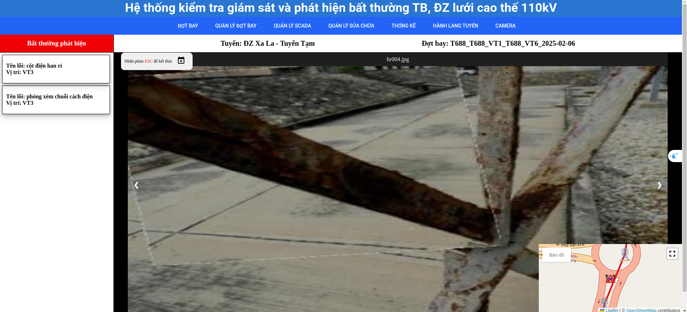
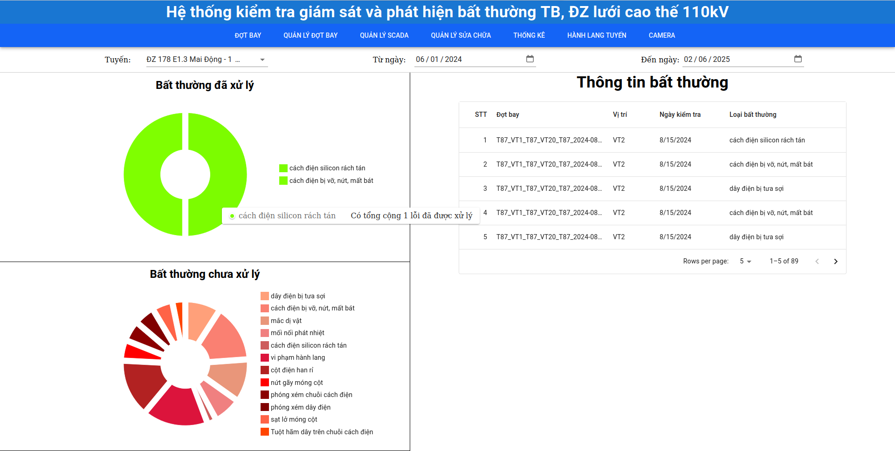

# Hệ Thống Giám Sát Lưới Điện Cao Thế

## Giới Thiệu
Hệ thống giám sát lưới điện cao thế với chức năng giám sát và quản lý dữ liệu điện sau giám sát.

Hệ thống bao gồm 7 tab chính:
- Đợt Bay
- Quản Lý Đợt Bay
- Quản Lý SCADA
- Quản Lý Sửa Chữa
- Thống Kê
- Hành Lang Tuyến
- Camera

## Chức Năng Chi Tiết

### 1. Tab Đợt Bay
- **Chức năng:** Phát hiện các bất thường trên đường dây truyền tải điện cao thế.
- **Đầu vào:** Video, ảnh.

#### 1.1 Phát hiện các bất thường ảnh quang

#### 1.2 Phát hiện các bất thường ảnh quang trong trường hợp đặc biệt, không có dữ liệu training

#### 1.3 Phát hiện các bất thường ảnh nhiệt

### 2. Tab Quản Lý Đợt Bay
- **Chức năng:** Quản lý kết quả các đợt bay sau khi cho video, ảnh chụp từ drone về đường dây truyền tải điện cần giám sát vào module AI để phân tích các bất thường.
- Kết quả là các ảnh bình thường hoặc bất thường của từng cột.
- Sau khi xem lại kết quả, người dùng có thể xuất báo cáo tự động theo chuẩn công ty Lưới Điện Cao Thế TP Hà Nội.

#### 2.1 Xem kết quả của đợt bay với ảnh quang

#### 2.2 Xem kết quả của đợt bay với ảnh nhiệt

#### 2.3 Xuất báo cáo

### 3. Tab Quản Lý SCADA
- **Chức năng:** Phân tích dữ liệu time series từ SCADA tại các trạm biến áp gửi về.
- Giúp đưa ra các cảnh báo sớm nếu có bất thường về dòng điện tại các trạm biến áp.

### 4. Tab Quản Lý Sửa Chữa
- **Chức năng:** Quản lý và xem chi tiết trong một tuyến chỉ định, bao nhiêu bất thường chưa xử lý và đã xử lý.
- Nếu chưa xử lý, người dùng cần cập nhật ảnh bất thường sau xử lý để chuyển trạng thái thành đã xử lý.

#### 4.1 Bất thường chưa xử lý

#### 4.2 Xem chi tiết bất thường chưa xử lý

#### 4.3 Cập nhật ảnh bất thường sau xử lý

#### 4.4 Bất thường đã xử lý

#### 4.5 Xem chi tiết bất thường đã xử lý

### 5. Tab Thống Kê
- **Chức năng:** Quản lý và thống kê các bất thường theo ngày và theo tuyến.
- Phần biểu đồ giúp người dùng nắm bắt nhanh số lượng bất thường chưa xử lý và đã xử lý.
- Phần bảng cung cấp thông tin chi tiết từng bất thường.

### 6. Tab Hành Lang Tuyến
- **Chức năng:** Xem hành lang tuyến dưới dạng 3D cloud point.
- Giúp người dùng dễ dàng kiểm tra có vi phạm hành lang tuyến hay không, như kiểm tra chiều cao của cây dưới đường dây điện hoặc khoảng cách công trình xây dựng tới đường dây.

### 7. Tab Camera
- **Chức năng:** Phát hiện các bất thường trên đường dây truyền tải điện cao thế tại các điểm nóng được gán camera theo dõi.
- **Đầu vào:** Luồng video RTSP.

